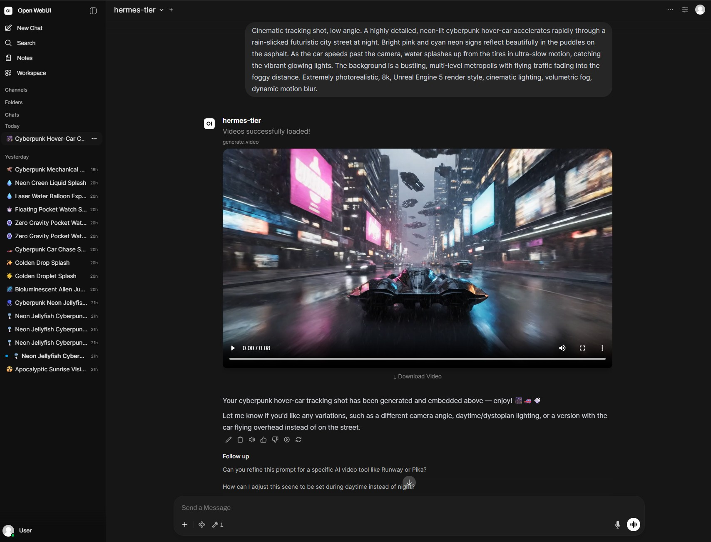

# OpenWebUI Veo 3.1 Video Generator

Generate hyper-realistic, cinematic videos directly within [OpenWebUI](https://openwebui.com/) using Google Vertex AI's new **Veo 3.1** model!

This script fully integrates Veo 3.1's advanced long-running operations and dynamically embeds a native HTML5 video player into your chat stream. 

### Features
✨ **Native Chat Embeds**: Videos render flawlessly inline as native HTML5 video players.
✨ **Custom UserValves**: Includes a custom settings UI allowing each user to choose their own **Aspect Ratio** (16:9 or 9:16), **Duration** (4s, 6s, 8s), and **Resolution** (720p, 1080p, 4K)!
✨ **Multi-Video Support**: Set the tool to generate up to 4 videos at once, and they will all stack neatly in the chat interface!
✨ **Downloads**: Direct download links are automatically generated below each video.
✨ **Non-blocking**: Uses an async polling loop to fetch long-running 4K video generation tasks without freezing your chat interface.

### Prerequisites
1. You must have a Google Cloud Project with the Vertex AI API enabled.
2. You must set up Application Default Credentials (e.g. running `gcloud auth application-default login` on your host machine) so your OpenWebUI Docker container can authenticate.

### Setup Instructions
1. Install this tool in your workspace using the `veo_video_tool.py` script.
2. Click the **Valves** (gear) icon for this tool on the admin page.
3. Enter your Google Cloud **Project ID**.
4. Enter your **Location ID** (e.g., `us-central1`).
5. (Optional) Adjust the `Max Timeout Seconds` if you plan to generate 4K 8-second videos, as those can take several minutes.

### Usage
Users can click the Tool Settings gear icon in their chat interface to customize their preferred aspect ratio, resolution, duration, and the number of videos to generate. Then, just mention the tool in chat with your prompt!
